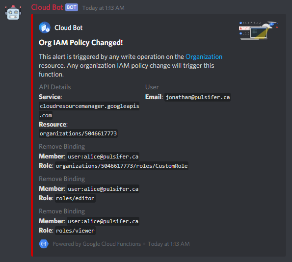

# orgPolicyAuditor

`orgPolicyAuditor` is a Google Cloud Function that lets me audit my [organization's IAM](https://cloud.google.com/resource-manager/docs/access-control-org) policy.

The function is triggered by PubSub messages from a [logging sink](https://cloud.google.com/logging/docs/export) filtered to contain [cloud audit activity logs](https://cloud.google.com/logging/docs/audit/#viewing_audit_logs) for my organization.

The audit logs are parsed and the result is a message to my Discord containing the attribution and changes.



## Prerequisites

The general flow looks like this:

```raw
Audit logs -> PubSub -> Function -> Discord
```

### Audit log configuration

Ensure `DATA_WRITE` logs are enabled for `iam.googleapis.com` on the organization by using the [Cloud Console](https://console.cloud.google.com/iam-admin/audit) or `gcloud`

```yaml
- auditLogConfigs:
  - logType: DATA_WRITE
  service: iam.googleapis.com
```

### Log sink configuration

Create a [logging sink](https://cloud.google.com/logging/docs/export) that publishes to a PubSub Topic with the following filter:

```raw
logName=(organizations/[YOUR_ORGANIZATION_ID]/logs/cloudaudit.googleapis.com%2Factivity)
```

### Function configuration

The entrypoint to the function is `PubSubber` in `pubsub.go`

```sh
gcloud functions deploy orgPolicyAuditor \
    --trigger-topic=your-pubsub-topic \
    --region=us-east1 \
    --runtime=go113 \
    --entry-point PubSubber \
    --project=your-project \
    --service-account=your-sa@your-project.iam.gserviceaccount.com \
    --memory=128Mi \
    --set-env-vars DISCORD_TOKEN="lol"
```
